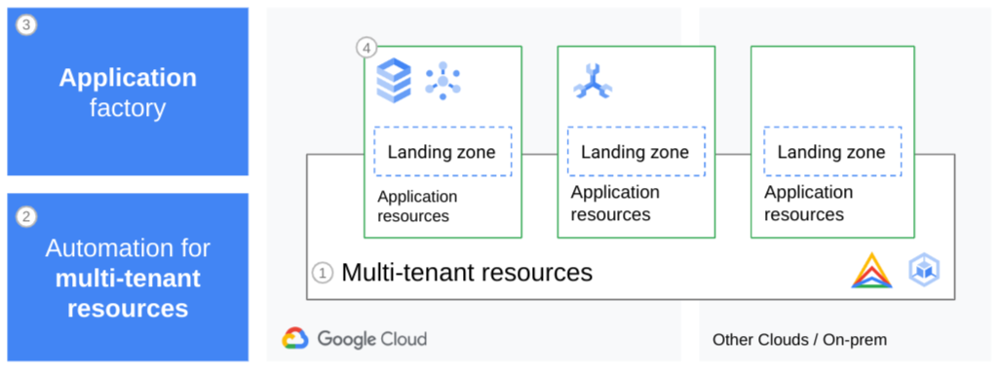
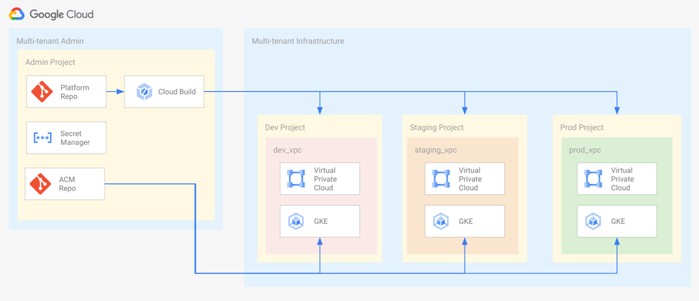
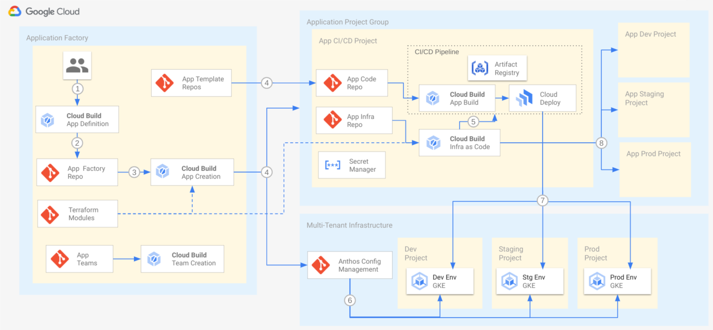

## Licensing

```lang-none
Copyright 2022 Google LLC

Licensed under the Apache License, Version 2.0 (the "License");
you may not use this file except in compliance with the License.
You may obtain a copy of the License at

    https://www.apache.org/licenses/LICENSE-2.0

Unless required by applicable law or agreed to in writing, software
distributed under the License is distributed on an "AS IS" BASIS,
WITHOUT WARRANTIES OR CONDITIONS OF ANY KIND, either express or implied.
See the License for the specific language governing permissions and
limitations under the License.
```

# Overview

Software delivery platforms enable organizations to shift the focus from individual technologies to highly automated/golden paths. That shift allows application teams to focus on delivering business value instead of having to learn new technology and tools. For example, if the process to create a new application including all of the supporting tools (Git repositories, CI/CD tools and application namespace) is automated and self service developers are able to quickly get the resources they need to delivery feature more quickly.

[](https://youtu.be/3mSm_HvvgOs "Next 2020 - Modern CI/CD with Anthos")

This blueprint extends the concepts discussed in the Next 2020 session on [Modern CI/CD with Anthos][modern-cicd-video] to include:

-   Self-service workflows for:
    -   Application onboarding
    -   Infrastructure as code
    -   Application team management
-   Scalable shared infrastructure
-   Patterns for implementing guardrails across the platform

## Table of contents

- [Overview](#overview)
  - [Table of contents](#table-of-contents)
  - [Core components and concepts](#core-components-and-concepts)
  - [Architecture](#architecture)
    - [Multi-tenant Architecture](#multi-tenant-architecture)
    - [Application Architecture](#application-architecture)
  - [Deploying the Blueprint](#deploying-the-blueprint)
  - [Contents of the Blueprint](#contents-of-the-blueprint)
  - [Licensing](#licensing)
  - [Usage](#usage)
  - [Contributing](#contributing)

## Core components and concepts

This section briefly discusses the core concepts needed to support the software delivery lifecycle and how to consistently manage that infrastructure. To improve software delivery performance, you need to implement CI/CD among other technical best practices to let teams release quickly and operate efficiently. The following terms and concepts are used throughout the blueprint, so they are critical to the overall understanding and successful implementation of the blueprint.

-   **Software delivery platform**. The framework and technical capabilities that make up the foundations of a high-velocity, reliable application release process. A software delivery platform unifies the tools and streamlines the processes needed to build, deliver, deploy, and operate applications. Responsibility for maintaining an application's configuration, stability, uptime, and scale varies between operators, security, and developer teams, but all of the components and teams need to work together to speed up releases.
-   **Platform infrastructure**. The infrastructure components and management considerations you need to build the platform and run your applications. To build a scalable software delivery platform, you have some set of shared tools and Kubernetes clusters for development, pre-production environments, and multiple production clusters.
-   **Software delivery workflow**. How teams work together to build, test, and deploy code more efficiently. When platform builders begin to define the CI/CD process, they need to ensure that each component produces or consumes artifacts that adhere to a standardized interface. Using a standardized interface simplifies the replacement of components when a better implementation comes to market. In the blueprint we have standardized on Container Images, Git Repositories and Kubernetes manifests.
-   **Code repositories**. Git repositories perform several functions: storing the actual business logic and application specific configuration, and serve as starter repositories that facilitate the adoption of best practices and help maintain consistency across automated processes.
-   **Application landing zones**. Logic entity that lets developers autonomously deploy and iterate on their applications using the guard rails that you put in place. For each application, you create a Kubernetes namespace in each cluster of each environment (for example, for production, QA, or staging). This consistency helps operators to debug and maintain the environments over time.

The platform, infrastructure and processes are all in place to accelerate application development and delivery, essentially serve teams within your organization. It is important to treat all of these components and processes as a product, meaning it is a software product, except that the users of the product are development, operations, and security teams. With that in mind, the platform requires the same software development roles and processes, such as product owners, marketing (albeit internal facing), user feedback loops, and feature development cycles.

For a more comprehensive discussion on these concepts refer to [Modern CI/CD with Anthos: A software delivery framework][modern-cicd]

## Architecture

In a platform there is infrastructure and supporting automation for both multi-tenant and application resources. The multi-tenant administration and application factory support the platform as they are responsible for creating and maintaining multi-tenant infrastructure and provisioning managing tenants on the platform. The multi-tenant and single-tenant infrastructure are used to serve one or more applications with the goal of maximizing resource utilization and developer/operations efficiency. The following diagram depicts the four main components of the software delivery blueprint.



1.  **Multi-tenant (shared) infrastructure**, this component supports multiple applications to reduce infrastructure and operational costs.
2.  **Automation for multi-tenant infrastructure**, contains the Infrastructure as Code pipeline and repository used to manage the shared resources. 
3.  **Application (tenant) Factory**, enables self-service workflows for teams across the organization to create application projects and landing zones.
4.  **Dedicated application infrastructure**, resources dedicated to a single application including GCP projects, databases and CI/CD pipelines.

### Multi-tenant Architecture

Running applications in a multi-tenant platform can increase overall resource utilization and mimimize the operational overhead.  By running multiple application on the same infrastructure the opportunties for bin packing are increased which means you can make more efficient use of the underlying CPUs, memory and disks reducing costs. Also by centralizing the resources used to run applications infrastructure administrators have few systems reducing operational overhead. The following diagram depict the multi-tenant infrastructure and automation used to support it.



Platform developers and administrators use an infrastructure as code pipeline in the multi-tenant admin project to deploy infrastructure used by many teams. The multi-tenant automation allows the platform team use a GitOps model, where the platform repo contains the source of truth what instructure is deployed.

The multi-tenant infrastructure component is a set of projects corresponding to the application environments. These projects contain resources used by several applications, to maximize resource utilization, governance and minimize operational overhead.

In the base blueprint, the shared resources are [Google Kubernetes Engine][gke] (GKE) clusters, but this could be extended to include other resources like databases, buckets, etc. The goal of the multi-tenant infrastructure is to improve efficiency in terms of operational overhead, resource utilization (cost) and consistency between environments (development, staging and production).

### Application Architecture

The architecture used for application infrastructure is intended to enable application teams self-serve when creating landing zones and resources dedicated to supporting a single application. Platform developers and operators are able to provide best practices for application teams through the application onboarding process, starter repos, and Terraform modules.  The following diagram depicts the overall architecture used to support application teams.



Using a factory pattern teams are able to onboard using declarative infrastructure as code and automation. A Cloud Build pipeline creates new git repositories, GCP projects, and application build and deployment pipelines declaratively. The application factory also allows team structure and access to repositories is also managed through an infrastructure as code process to improve repeatability.

New application repositories are created off of [starter repositories][starter-repos], which are templates encapsulating the best practices for building applications on the platform. CI/CD and infrastructure as code pipelines for the single tenant resources are also based on a templated starter and shared infrastructure as code modules maintained by the platform and operations teams.

The infra deployed to support a single application has four primary components: landing zone, application CI/CD pipeline, infrastructure as code pipeline and resource projects.

The application landing zone is a locked-down logic entity that lets developers deploy and iterate on their applications. In the blueprint, namespaces, network policies and workload identity are created using [Anthos Config Management][acm] (ACM). Pods, services and other application configuration are deployed using the applications CI/CD pipeline and Cloud Deploy.

The application CI/CD pipeline is composed of [Cloud Build][cloud-build] and [Cloud Deploy][cloud-deploy] is triggered based on changes to the application's code repo. The pipeline produces new application artifacts which are then deployed into the multi-tenant infrastructure. Applications deployed into the infrastructure are managed by the application developer and operations teams, while the infrastructure is managed by the platform teams.

The application infrastructure as code pipeline is triggered off of the application’s infrastructure repository. That pipeline is responsible for deploying resources into the environment projects dedicated to the application. Those projects contain resources used only by that application and management for those resources is handled by the application development and operations teams.  Infrastructure deployed through this pipeline should be based on modules provided by the platform teams.

## Deploying the Blueprint

To deploy the blueprint the Application Factory and Multi-tenant Admin projects are deployed using the launch scripts. The launch scripts are one time use scripts that create the git repositories and projects to used in those components.

1.  From Cloud Shell or a Bash environment run `launch-scripts/software-delivery-infra.sh`.

    See [launch-scripts readme - software-delivery-infra.sh][launch-scripts-infra-instructions] for more detailed instructions.

2.  From Cloud Shell or a Bash environment run `launch-scripts/software-delivery-app.sh`.

    See [launch-scripts readme - software-delivery-app.sh][launch-scripts-app-instructions] for more detailed instructions.

3.  Deploy the multi-tenant infrastructure using the multi-tenant IaC pipeline.

    See [platform-template readme - Infrastructure Pipleine][platform-template-infra-pipeline] for more details.

4.  Create applications using the application factory.

    See [app-factory-template readme - Create a new Application][app-factory-template-add-app] for step by step instructions.

## Contents of the Blueprint

The following table contains a brief description of the code contained in each
directory.  For a more detailed description visit the README of the respective
directory.

The directories and code in this repository need to be split out into
multiple different repositories for separation of duties. Creation of those
repos is done through helper scripts in the `launch-scripts` directory.

| Directory                                      | Description
| ---------------------------------------------- | ----------
| [`acm-template`][acm-template]                 | This directory contains the template used to initialize the Anthos Config Management (ACM) repo, which helps provision landing zones and keep environments consistent.
| [`app-factory-template`][app-factory-template] | App factory contains the Terraform specifying the applications and teams deployed on the software delivery platform.
| [`app-template-golang`][app-template-golang]   | Starter application for Golang applications
| [`app-template-java`][app-template-java]       | Starter application for Java applications
| [`app-template-python`][app-template-python]   | Starter application for Python applications
| [`infra-template`][infra-template]             | Template used to initialize each application's infrastructure as code repository.
| [`launch-scripts`][launch-scripts]             | Helper scripts used to deploy the software delivery blueprint.
| [`platform-template`][platform-template]       | Platform template contains the Terraform to create the multi-tenant infrasture supporting application deployment.
| `resources`                                    | Images and other resources used in documentation.
| [`terraform-modules`][terraform-modules]       | Terraform modules that are used by application and platform teams when creating infrastructure.


## Usage

Copyright 2022 Google. This software is shared as sample code and not intended
for production use and provided as-is, without warranty or representation for
any use or purpose. Your use of it is discretionary and subject to your
agreement with Google.

## Contributing

* [Contributing guidelines][contributing-guidelines]
* [Code of conduct][code-of-conduct]

<!-- LINKS: https://www.markdownguide.org/basic-syntax/#reference-style-links -->

[contributing-guidelines]: CONTRIBUTING.md
[code-of-conduct]: code-of-conduct.md

[acm]: https://cloud.google.com/anthos/config-management
[acm-template]: acm-template/README.md
[app-factory-template]: app-factory-template/README.md
[app-factory-template-add-app]: app-factory-template/README.md#create-a-new-application
[app-template-golang]: app-template-golang/README.md
[app-template-java]: app-template-java/README.md
[app-template-python]: app-template-python/README.md
[infra-template]: infra-template/README.md
[launch-scripts]: launch-scripts/README.md
[launch-scripts-infra-instructions]: launch-scripts/README.md#software-delivery-infrash
[launch-scripts-app-instructions]: launch-scripts/README.md#software-delivery-appsh
[platform-template]: platform-template/README.md
[platform-template-infra-pipeline]: platform-template/README.md#infrastructure-pipeline
[terraform-modules]: terraform-modules/README.md
[modern-cicd]: https://cloud.google.com/architecture/modern-cicd-anthos-user-guide
[modern-cicd-video]: https://youtu.be/3mSm_HvvgOs
[starter-repos]: https://cloud.google.com/architecture/modern-cicd-anthos-user-guide#starter_repositories
[cloud-deploy]: https://cloud.google.com/deploy
[cloud-build]: https://cloud.google.com/build/docs/overview
[gke]: https://cloud.google.com/kubernetes-engine
