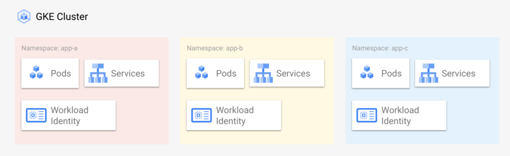

# Overview

`acm-template` contains the [Anthos Config Management (ACM)][acm] starting point configuration for the multi-tenant platform. The `acm-template` folder is hydrated into a repository during the execution of the [`bootstrap.sh`][software-delivery-infra]
script.

The Anthos Config Management repo contains the k8s configuration for the multi-tenant [Google Kubernetes Engine (GKE)][gke] clusters. After the GKE clusters in multi-tenant infrastructure are created, they are associated with this repo for config management. In this blueprint we have chosen to store cluster configuration (Cluster, ClusterSelector, etc), policies, and application landing zones (Namespace, RBAC, NetworkPolicy, Workload Identity, etc.) all of which should be deployed fleet wide or at the granularity of clusters. Deploying the cluster configuration equally to all environments to helps maintain consistency between environments. In some places [ClusterSelectors][cluster-selectors] are used to apply manifests to subset of clusters or environments. Application configuration (Service, ReplicaSet, ConfigMap, HPA, etc.) is deployed with [Cloud Deploy][cloud-deploy]. Typically, application config has a higher velocity of change and more variation within an individual cluster for example canary deployments.

This repo contains three branches dev, staging and prod corresponding to the environments in the multi-tenant infrastructure. Changes can only be pushed to the default branch i.e. dev, in order to push the code to higher branches, use pull requests and merge changes into the higher environment branches.

All clusters are configured to monitor the `manifests` folder for their respective branch. The next sections will discuss the `manifests` and `templates` directory in more detail.

## Table of Contents

- [Overview](#overview)
  - [Table of Contents](#table-of-contents)
  - [Manifests](#manifests)
    - [Apps](#apps)
    - [Clusters](#clusters)
    - [Constraints](#constraints)
  - [Templates](#templates)
  - [Workflow](#workflow)
  - [Licensing](#licensing)
  - [Usage](#usage)
  - [Contributing](#contributing)

## Manifests

All clusters are configured to monitor the `manifests` folder for their respective branch. This helps to ensure consistent configuration across environments and clusters.  There are three subdirectories `apps`, `clusters` and `constraints` in the `manifests` directory.  The directories, while not required help when reviewing and organizing changes.

### Apps



The `apps` directory contains the foundational configuration or landing zone for a specific application, this includes:

-   [Namespace][namespace]
-   [Network policy][network-policies]
-   Service account for [workload identity][workload-identity]
-   [RBAC][rbac] for the application deployment service account

Landing zone manifests are hydrated from the `_namespace-template` by the Application Factory when creating an application.

### Clusters

The `clusters` directory contains the base configuration for a cluster in the multi-tenant infrastructure, including a basic cluster selector. These manifests are hydrated from the `_cluster-template` when clusters are registered with ACM.

### Constraints

The `constraints` directory contains policies that should be applied fleet wide. A security specialist can add, remove or update the policies in yaml format that will automatically get reflected on the GKE cluster. An example of such policies could be to block any pod from being deployed into the default namespace.

## Templates

`templates` contains the templates that are used when provisioning clusters and applications in the platform. The yaml files contained in the templates are hydrated with some variable substituion into the `manifests` directory, so they can be applied to the GKE clusters.

## Workflow

Updates to the configuraiton manifests, all follow a similar workflow where changes are made in the dev branch and then reviewed merged into higher environment branches.

For example, to make changes to GKE clusters policies, change the policies under `manifests/constraints` folder on the dev branch, commit and push the changes. Once done that, the changes will get applied to GKE clusters in the dev environment.

When you have reviewed the changes on dev cluster and are ready to deploy in staging, create a pull request (PR) from dev to staging. As soon as the PR is approved, the changes are merged to staging branch and policies are applied to staging GKE cluster as it is connected to staging folder of staging branch.

Similarly, to make changes in prod, create PR from staging to prod. As soon as the PR is approved, the changes are merged to prod branch and policies are applied to GKE clusters in the prod environment.

## Licensing

```lang-none
Copyright 2022 Google LLC

Licensed under the Apache License, Version 2.0 (the "License");
you may not use this file except in compliance with the License.
You may obtain a copy of the License at

    https://www.apache.org/licenses/LICENSE-2.0

Unless required by applicable law or agreed to in writing, software
distributed under the License is distributed on an "AS IS" BASIS,
WITHOUT WARRANTIES OR CONDITIONS OF ANY KIND, either express or implied.
See the License for the specific language governing permissions and
limitations under the License.
```

## Usage

Copyright 2022 Google. This software is shared as sample code and not intended
for production use and provided as-is, without warranty or representation for
any use or purpose. Your use of it is discretionary and subject to your
agreement with Google.

## Contributing

*   [Contributing guidelines][contributing-guidelines]
*   [Code of conduct][code-of-conduct]

<!-- LINKS: https://www.markdownguide.org/basic-syntax/#reference-style-links -->

[contributing-guidelines]: CONTRIBUTING.md
[code-of-conduct]: code-of-conduct.md

[acm]: https://cloud.google.com/anthos/config-management
[cloud-deploy]: https://cloud.google.com/deploy
[cluster-selectors]: https://cloud.google.com/anthos-config-management/docs/how-to/clusterselectors
[gke]: https://cloud.google.com/kubernetes-engine
[software-delivery-infra]: ../launch-scripts/bootstrap.sh
[workload-identity]: https://cloud.google.com/kubernetes-engine/docs/how-to/workload-identity
[namespace]: https://kubernetes.io/docs/concepts/overview/working-with-objects/namespaces/
[network-policies]: https://kubernetes.io/docs/concepts/services-networking/network-policies/
[rbac]: https://kubernetes.io/docs/reference/access-authn-authz/rbac/