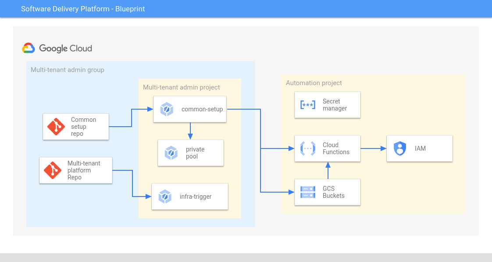

# Overview

`common-setup` contains the infrastructure as code (IaC) for provisioning the automation workflows. The `common-setup` folder is hydrated into a repository during the execution of the [bootstrap.sh][bootstrap] script.

Workflows like automatic access provisioning of the Applications will be created through this repo. For example, when an application is created, the Service Account that deploys the application to GKE will need access on the cluster to do so. The automation workflows via this repo make that happen.
Since this workflow is common across this Software Delivery Platform, we are calling it common setup repo.
## Table of Contents

- [Overview](#overview)
  - [Table of Contents](#table-of-contents)
  - [Architecture](#architecture)
  - [Automation workflow pipeline](#automation-workflow-pipeline)
  - [Automation workflows](#automation-workflows)
  - [Usage](#usage)

## Architecture

The above diagram depicts the architecture used for automation workflows.

### Automation Workflow pipeline

The `common-setup` repo is connected to a [Cloud Build][cloud-build] trigger in multi-tenant admin project and listens to any push that happens on this repo. When a push happens, the trigger gets invoked and runs the Terraform on the files in the repo.

### Automation Workflows

When the [Cloud Build][cloud-build] trigger in multi-tenant admin project that is connected to `common-setup` repo runs, it creates:

- Three [Cloud Functions][cloud-function] and [GCS buckets][gcs]:
   1. add-secret-permission function in automation workflow project.
      1. This [Cloud Function][cloud-function] is used to provide read permission on secrets stored in secretmanager to application service accounts. 
      2. The [Cloud Function][cloud-function] is triggered when an object arrives in the GCS bucket `add-secret-permission-trg`. 
      3. The Application Factory while creating a new application writes the service account that needs this access to the GCS bucket `add-secret-permission-trg` as an object. This invokes the Cloud Function that provides the service account the required access.
   2. add-billing-permission function in multi-tenant admin project.
      1. This [Cloud Function][cloud-function] is used to provide billing user role to application service accounts so that they can create new projects.
      2. The [Cloud Function][cloud-function] is triggered when an object arrives in the GCS bucket `add-billing-permission-trg`.
      3. The Application Factory while creating a new application writes the service account that needs this access to the GCS bucket `add-billing-permission-trg` as an object. This invokes the Cloud Function that provides the service account the required access.
   3. add-project-permission function in multi-tenant admin project.
      1. This [Cloud Function][cloud-function] is used to provide project creator role to application service accounts so that they can create new projects.
      2. The [Cloud Function][cloud-function] is triggered when an object arrives in the GCS bucket `add-project-permission-trg`.
      3. The Application Factory while creating a new application writes the service account that needs this access to the GCS bucket `add-project-permission-trg` as an object. This invokes the Cloud Function that provides the service account the required access.

- A VPC in multi-tenant admin project for peering with Cloud Build service producer network. 
- [Cloud Build private pool][private-pool] in multi-tenant admin project that will be running the pipelines multi-tenant project and application factory. 

## Usage

Copyright 2022 Google. This software is shared as sample code and not intended
for production use and provided as-is, without warranty or representation for
any use or purpose. Your use of it is discretionary and subject to your
agreement with Google.

<!-- LINKS: https://www.markdownguide.org/basic-syntax/#reference-style-links -->

[bootstrap]: ../launch-scripts/bootstrap.sh
[cloud-build]: https://cloud.google.com/build/docs/overview
[cloud-function]: https://cloud.google.com/functions
[private-pool]: https://cloud.google.com/build/docs/private-pools/private-pools-overview
[gcs]: https://cloud.google.com/storage