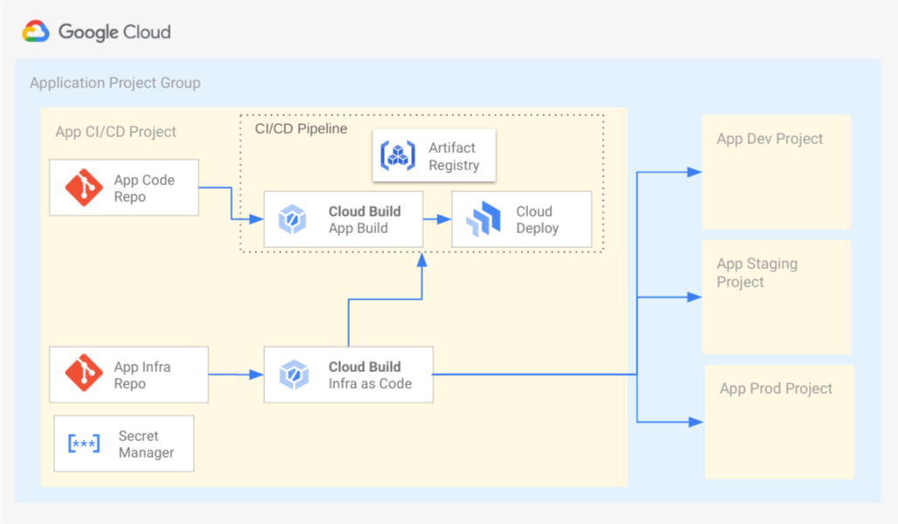

# Overview

`infra-template` contains the infrastructure as code (IaC) for provisioning the single tenant application project group infrastructure. The `infra-template` folder is hydrated into a template repository during the execution of the [`bootstrap.sh`][software-delivery-app] script. During the creation of a new application by the Application Factory, the infrastructure template repository is then instantiated into an application specific IaC repository called `<app_name>-infra`.

## Table of Contents

- [Overview](#overview)
  - [Table of Contents](#table-of-contents)
  - [Architecture](#architecture)
  - [Usage](#usage)

## Architecture

The above diagram depicts the architecture of the Application Project Group and how the infra-template and Cloud Build IaC trigger manages those projects. The repo created from the infrastructure template follows the [branch and folder pattern][next19-infra-as-code] to reperesent and manage environments. Each repo has four branches and folders cicd-trigger, dev, staging and prod.

-   Admin project branch (cicd-trigger)
    -   The cicd-trigger branch/folder contains the IaC used to maintain the application's admin project which hosts the CI/CD and IaC pipelines for the application.
-   Environment branches (dev, staging, prod)
    -   The other branches/folders represent environments containing infrastructure dedicated to a single application. Similar to the multi-tenant infrastructure repo you can only push to dev branch, in order four to higher branches, use pull requests to review and merge changes into the staging and production environments.

## Usage

Copyright 2022 Google. This software is shared as sample code and not intended
for production use and provided as-is, without warranty or representation for
any use or purpose. Your use of it is discretionary and subject to your
agreement with Google.

<!-- LINKS: https://www.markdownguide.org/basic-syntax/#reference-style-links -->

[software-delivery-app]: ../launch-scripts/bootstrap.sh
[next19-infra-as-code]: https://www.youtube.com/watch?v=3vfXQxWJazM