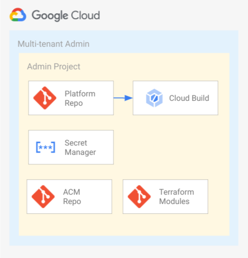
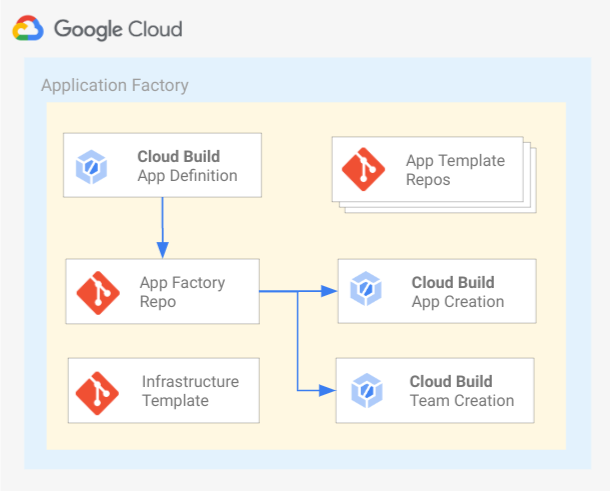

# Overview

`launch-scripts` contains a shell script `bootstrap.sh` that is used to bootstrap the software delivery platform. This script is intended to be executed one time to initialize Application Factory and Multi-tenant Admin components of the blueprint. Once deployed updates to those components are expected to be made directly in the respective component.

## Table of Contents

- [Overview](#overview)
  - [Table of Contents](#table-of-contents)
  - [bootstrap.sh](#bootstrapsh)
    - [Prerequisites](#prerequisites)
    - [Execute](#execute)
  - [Usage](#usage)

## bootstrap.sh

`bootstrap.sh` is used to create:
    
1. The projects and infrastructure necessary to manage the multi-tenant infrastructure which includes:

   - Multi-tenant admin project
     - Infrastructure as Code pipeline
     - Automation workflow pipeline
   - Automation workflow project
     - Secrets
   - Git repositories hydrated from:
       - [acm-template][acm-template]
       - [platform-template][platform-template]
       - [terraform-modules][terraform-modules]
       - [common-setup][common-setup]

     

       The above diagram depicts the resources deployed and their connections. For more details on the function of the Multi-tenant Admin Project refer to the [platform-template readme][platform-architecture] and [common-setup readme][common-setup-readme].

2. The application factory, which automates the process of creating applications, teams and landing zones in the software delivery platform which includes:

   - Application factory project
     - Cloud Build triggers:
       - create a application
       - manage GitHub teams
       - plan/apply Terraform used to managed applications and teams

   - Git repositories hydrated from:
       - [app-factory-template][app-factory-template]
       - [app-template-golang][app-template-golang]
       - [app-template-java][app-template-java]
       - [app-template-python][app-template-python]
       - [infra-template][infra-template]

   

     The above diagram depicts the resources deployed and their connections.  For more details on the function of the Application Factory refer to the [app-factory-template readme][app-factory-architecture].

### Prerequisites


1. The user executing the script requires the following IAM roles and permissions.

    - Organization Administrator
    - Project Creator
    - Folder Admin; required only if you pass Folder Name to the script
    - Billing Account Administrator (optional). If you do not have this access, you can still run the script and bootstrap the blueprint. You will manually need to grant billing.user role to CloudBuild Service Accounts in multi-tenant admin and Application factory projects later.

2. The script will prompt for the following information.

| Input Value                 | Description
|-----------------------------| --------------------
| Organization Name           | The name of your Google Cloud Organization.
| Billing Account ID          | Your 18 character billing account ID in the format of xxxxxx-xxxxxx-xxxxxx.
| Folder Name                 | Optional, folder that the multi-tenant admin project should be deployed in. Leave blank to deploy to the top-level of the organization. If the Folder Name provided does not exist, the script will create it first. 
| Multi-tenant Admin Project  | Project name that should be used for the multi-tenant IaC pipeline, also called multi-tenant admin project.  The value provided will be appended with 6 random characters.
| Multi-tenant IaC Repo       | Name of the git repository where the platform-template will be cloned and hydrated into.
| Application Factory Project | Project name that should be used for Application Factory. The value provided will be appended with 6 random characters.
| Application Factory Repo    | Name of the git repository where the app-factory-template will be cloned and hydrated into.
| GitHub User                 | GitHub username that can be used throughout the blueprint for interacting with GitHub.
| GitHub Access Token         | GitHub access token for the specified user, must have the following permissions: **repo:** Full control of private repositories, **delete_repo:** Delete reposistories, **admin:org:** Full control of orgs and teams, read and write org projects and **admin:repo_hook:** Full control of repository hooks.
| GitHub Organization         | The name of your GitHub Organization.
| Region                      | The region where the resources are created.
| Secondary Region            | Secondary region for resources that are created in multiple regions.
| Cloud Build Trigger Type    | Options: **webhook** or **github**. This specifies which type of Cloud Build triggers should be created in the multi-tenant admin and application factory projects.


### Execute

1.  Open cloudshell or any terminal that has gcloud installed.
2.  Authenticate:
    - `gcloud auth login --no-launch-browser`
    - The above command will generate a link, click on it, enter password if needed and you will get an access code.
    - Go back to cloudshell/terminal and enter the access code to authenticate.
3.  Clone the repo blueprint repo.

    `git clone https://github.com/GoogleCloudPlatform/software-delivery-blueprint.git`

4.  `cd software-delivery-blueprint/launch-scripts`
5.  `./bootstrap.sh` the script will prompt for the inputs listed in the prerequistes section. Alternatively, you can provide these inputs in  [vars.sh][vars.sh] under launch-script directory by copying the following text and replacing the placeholders. Then run `./bootstrap.sh`. The script sources vars.sh so it will fetch the inputs from there.
```
export INFRA_SETUP_PROJECT=<Project name that should be used for the multi-tenant IaC pipeline, also called multi-tenant admin project>
export INFRA_SETUP_REPO=<Name of the git repository where the platform-template will be cloned and hydrated into>
export APP_SETUP_PROJECT=<Project name that should be used for Application Factory>
export APP_SETUP_REPO=<Name of the git repository where the app-factory-template will be cloned and hydrated into>
export BILLING_ACCOUNT_ID=<Your 18 character billing account ID>
export ORG_NAME=<The name of your Google Cloud Organization>
export FOLDER_NAME=<Optional, folder that the multi-tenant admin project should be deployed in>
export GITHUB_USER=<GitHub username>
export TOKEN=<GitHub access token, must have the following permissions: **repo:** Full control of private repositories, **delete_repo:** Delete reposistories, **admin:org:** Full control of orgs and teams, read and write org projects and **admin:repo_hook:** Full control of repository hooks.>
export GITHUB_ORG=<The name of your GitHub Organization>
export REGION=<The region where the resources are created>
export SEC_REGION=<Secondary region for resources that are created in multiple regions>
export TRIGGER_TYPE=<webhook or github>
```

Once the script is completed, you will see the output in the following format at the end :
```
Multi-tenant admin project  : XXXXXX
Automation workflow project : XXXXXX
Application Factory project : XXXXXX
```
- Switch to the multi-tenant admin project in GCP console and you will see two Cloud Build pipelines running. 
  - These two pipelines will be corresponding to `create-infra` and `common-setup` Cloud Build triggers respectively.
  - When `create-infra` pipeline finishes, a dev deployment of the multi-tenant infrastructure will be completed after the pipeline completes. To deploy the remaining environments follow the workflow from the [platform-template readme][platform-template-pipeline].
  - When `common-setup` pipeline finishes, three Cloud Functions will be deployed along with GCS buckets in Automation workflow project. For details about this pipeline, see [common-setup readme][common-setup-pipeline]
- Switch to Automation workflow project after the `common-setup` pipeline is completed in multi-tenant admin project. 
  - You should see three Cloud Functions created.
  - There will be two GCS buckets corresponding to each Cloud Function in the same project, one to hold the code of the function and another to act as a trigger to the function.
- Switch to Application factory project and you will see four Cloud Build triggers connected to Application factory repo. 

## Usage

Copyright 2022 Google. This software is shared as sample code and not intended
for production use and provided as-is, without warranty or representation for
any use or purpose. Your use of it is discretionary and subject to your
agreement with Google.

<!-- LINKS: https://www.markdownguide.org/basic-syntax/#reference-style-links -->
[acm-template]: ../acm-template/
[app-factory-template]: ../app-factory-template/
[app-factory-architecture]: ../app-factory-template/README.md#application-factory-architecture
[app-template-golang]: ../app-template-golang/
[app-template-java]: ../app-template-java/
[app-template-python]: ../app-template-python/
[external-accounts]: https://support.google.com/a/answer/9007750?hl=en&ref_topic=25840
[infra-template]: ../infra-template/
[platform-template]: ../platform-template/
[platform-architecture]: ../platform-template/README.md#architecture
[platform-template-pipeline]: ../platform-template/README.md#infrastructure-pipeline
[terraform-modules]:../terraform-modules/
[common-setup]:../common-setup/
[common-setup-readme]: ../common-setup/README.md
[common-setup-pipeline]: ../common-setup/README.md#automation-workflows
[vars.sh]: ./vars.sh