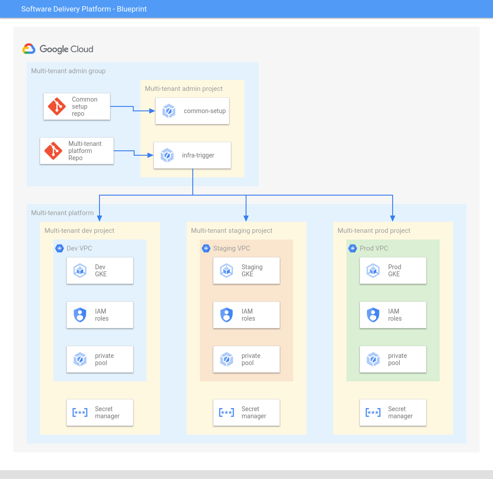

# Overview

`platform-template` contains the infrastructure as code (IaC) for provisioning the multi-tenant platform infrastructure. The `platform-template` folder is hydrated into a repository during the execution of the [bootstrap.sh][software-delivery-infra] script.

Running applications in multi-tenant infrastructure can increase overall resource utilization and mimimize the operational overhead.  By running multiple application on the same infrastructure the opportunties for bin packing are increased which means you can make more efficient use of the underlying CPUs, memory and disks reducing costs. Also by centralizing the resources used to run applications infrastructure administrators have few systems reducing operational overhead.

## Table of Contents

- [Overview](#overview)
  - [Table of Contents](#table-of-contents)
  - [Architecture](#architecture)
    - [Infrastructure pipeline](#infrastructure-pipeline)
    - [Application landing zones](#application-landing-zones)
  - [Add new environment](#add-new-environment)
  - [Usage](#usage)

## Architecture

The above diagram depicts the architecture used for the multi-tenant infrastructure and application landing zones.

### Infrastructure pipeline

The multi-tenant IaC platform repo follows the [branch and folder pattern][next19-infra-as-code]
to reperesent and manage environments. The repo contains three branches
and folders dev, staging and prod. You can only push to dev branch, in order
to push the code to higher branches, use pull requests to review and merge
changes into the staging and production environments.

The multi-tenant platform repo is connected to a [Cloud Build][cloud-build] trigger in multi-tenant admin project and listens to any push that happens on this repo. When a push happens, the trigger catches the branch where the push happened and executes the Terraform in the corresponding directory under env directory. This results in creation of multi-tenant infrastructure for that environment.

Each environment has their own set of Terraform files under their folder, so
you can make customizations in an environment by adding or removing code in
their files without impacting the other environments. e.g you can add code to
your dev Terraform files to create a GCS bucket and, it will only be created in
dev without impacting other environment.

### Application landing zones

A landing zone is a locked-down logic entity that lets developers deploy and iterate on their applications. Application landing zones use the guard rails that you put in place so that developers can operate autonomously. For each application, you create a Kubernetes namespace in each cluster of each environment (for example, for production, dev, or staging). This consistency helps operators to debug and maintain the environments over time.

In the blueprint namespaces, network policies and workload identity are created using [Anthos Config Management][acm] (ACM). Pods, services and other application configuration are deployed using the [applications CI/CD pipeline][infra-template] and [Cloud Deploy][cloud-deploy].

## Add new environment

You can easily create a new environment by creating a new branch and folder
with the name of the desired environment. To initialize the new environment
copy the Terraform code from another envirment to the new folder and replace
any hardcoded variables/names in the Terraform code.

For example if you want to create a new environment named `qa`:

1.  Create a new branch named `qa` from `dev` branch.
2.  Create a folder `env/qa` and copy the files from `env/dev` folder into
the `qa` folder.
3.  Scan through the files in `qa` folder and replace any "dev" pattern with
"qa".
4.  Commit and push changes to `dev` branch.
5.  Create a Pull Request from `dev` to `qa`.
6.  On approval the Cloud Build trigger will get invoked, creating a Google Cloud project and infrastructure for the `qa` environment.

## Usage

Copyright 2022 Google. This software is shared as sample code and not intended
for production use and provided as-is, without warranty or representation for
any use or purpose. Your use of it is discretionary and subject to your
agreement with Google.

<!-- LINKS: https://www.markdownguide.org/basic-syntax/#reference-style-links -->
[acm]: https://cloud.google.com/anthos/config-management
[cloud-deploy]: https://cloud.google.com/deploy
[infra-template]: ../infra-template/README.md
[software-delivery-infra]: ../launch-scripts/bootstrap.sh
[next19-infra-as-code]: https://www.youtube.com/watch?v=3vfXQxWJazM
[cloud-build]: https://cloud.google.com/build/docs/overview